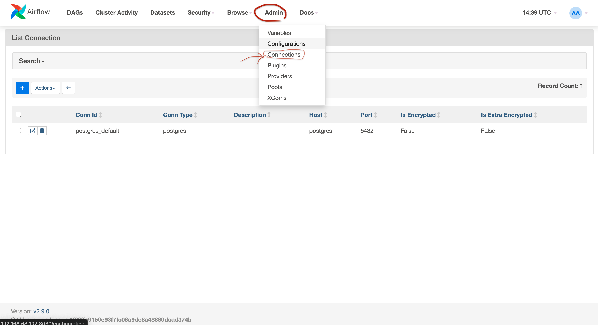
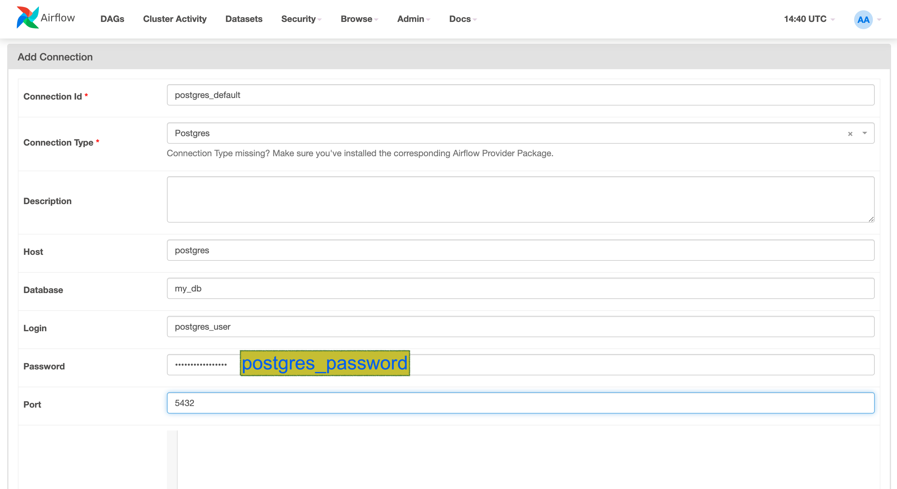
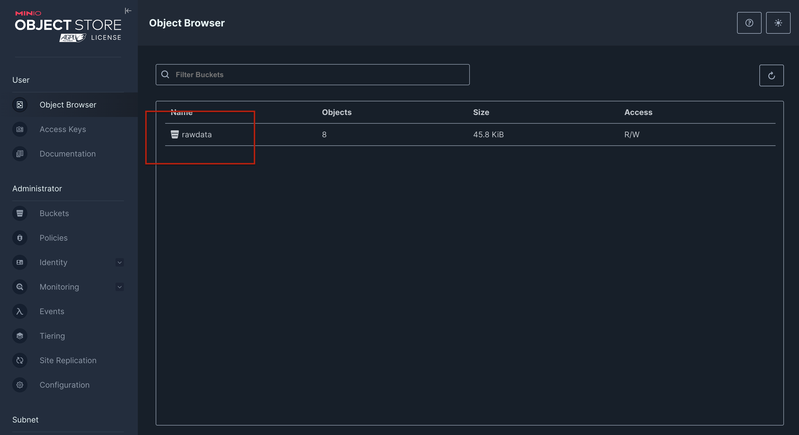
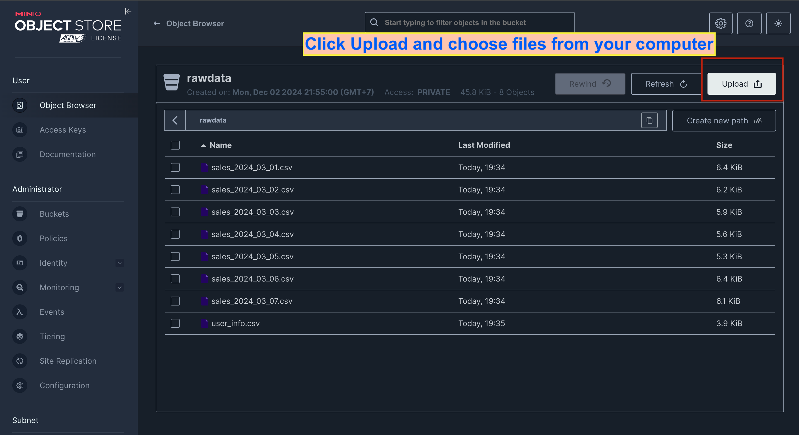
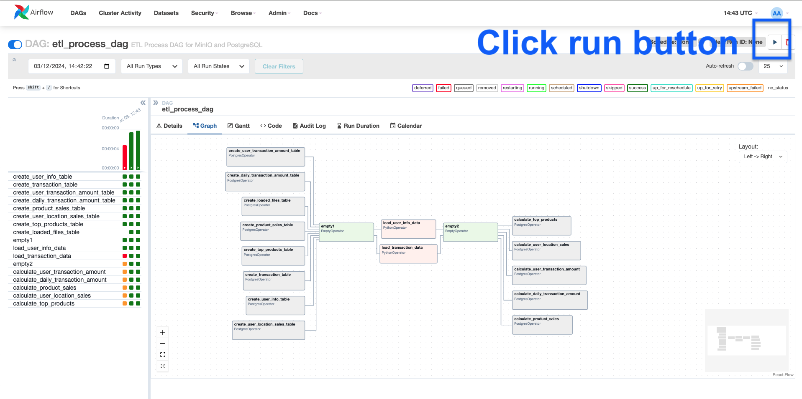
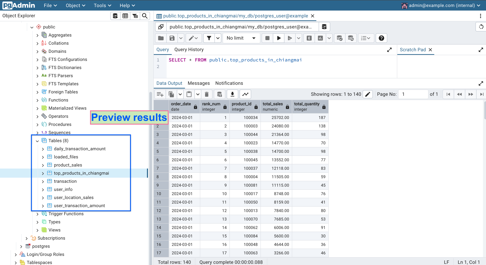

# Data Engineer Tests Part3-Version2

This project demonstrates running an ETL process using Apache Airflow to create and populate tables in a PostgreSQL database. The setup utilizes Docker for a consistent, portable, and reproducible environment.

## Features
- ETL Workflow Management with Apache Airflow.
- Storage using MinIO for raw data.
- PostgreSQL as the database backend for transformed data.
- A fully containerized environment leveraging Docker Compose.

## Prerequisites
Before starting, ensure the following tools are installed:

1. Docker: Install from Get [Get Docker](https://docs.docker.com/get-docker/).
2. Docker Compose: Comes bundled with Docker Desktop or install separately from Compose Installation.

## Getting Started

### 1. Clone the repository
```
git clone https://github.com/norasit/test_de_role_pt3_v2.git
```
```
cd test_de_role_pt3_v2
```
On **Linux**, please make sure to configure the Airflow user for the docker-compose:

```sh
echo -e "AIRFLOW_UID=$(id -u)" > .env
```
### 2. Build and Start the Docker Services
1. Build and start the services:
```
docker compose up --build
```
2. Verify services:
- Airflow: Open your browser and go to http://localhost:8080.
- Login credentials:
  - **Username**: `airflow`
  - **Password**: `airflow`
- MinIO: Open your browser and go to http://localhost:9000.
- Login credentials:
  - **Username**: `admin`
  - **Password**: `password`
- PostgreSQL: The database will be accessible at localhost:5432.
- pgAdmin: Open your browser and go to http://localhost:5050.
- Login credentials:
  - **Email**: `admin@example.com`
  - **Password**: `admin1234`

### 3. Setting up Airflow Connection
Before running the DAG, establish the necessary connections in Airflow:



### 4. Upload files to MinIO Bucket
In practice, routine operations require users to upload raw data files to the MinIO bucket. This process allows flexibility for manual or automated file management.



### 5. Run DAG file
The DAG file can be configured for daily scheduling or other intervals as per requirements. In this project, the DAG is set to be manually triggered for demonstration purposes.


### 6. Verify results in pgAdmin
Access pgAdmin and verify tables and data:


### Stopping the Services
To stop the services, run:
```bash
docker compose down
```
This command will gracefully shut down all containers and services.

## Key Notes
- **Routine File Management**:
    - Users are responsible for uploading files (user_info.csv and sales_*.csv) to the MinIO bucket as part of daily or periodic operations. This ensures that the DAG processes only the latest data.
- **Incremental Loading**:
    - The user_info.csv file is processed with upsert logic to ensure updates or new records are reflected in the database.
    - The sales_*.csv files are processed incrementally, appending new data to the database without duplication.
- **Flexible Scheduling**:
    - While the DAG is currently triggered manually, you can set a daily schedule or other intervals by modifying the schedule_interval parameter in the DAG file.